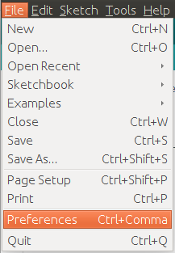
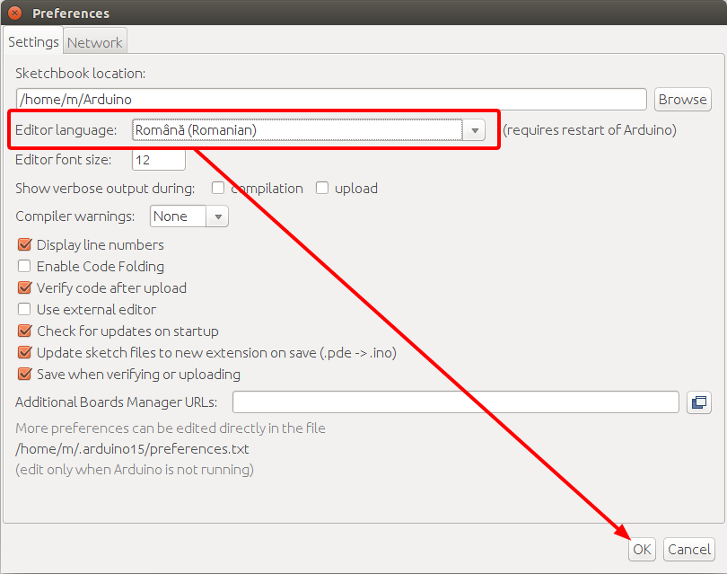
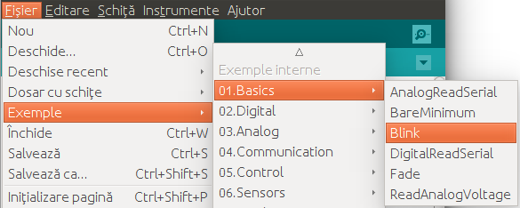
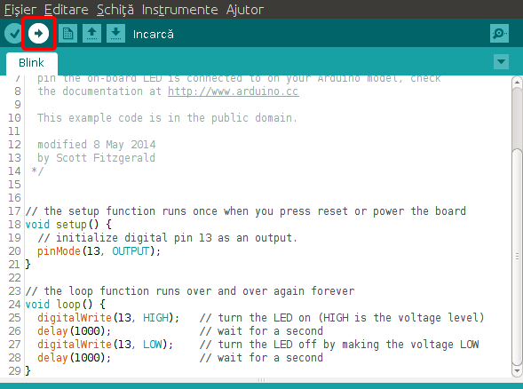
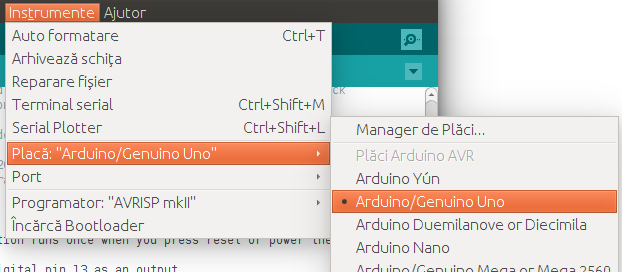
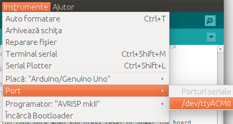

Primul Program în IDE
=====================

1. Deschideți IDE-ul. Iconița programului arată așa: |ide-icon|

2. Schimbați limbla IDE-ului în Română.

    1. Intrați în meniul **File > Preferences**

    |ide-menu-preferences|

    2. Selectați limba Română și apesați OK

    |ide-menu-change-lang|

    3. Închideți IDE-ul și porniți-l din nou *(faceți restart)*.

    Acum toate textele sunt în limba Română.

3. Găsiți și faceți click pe meniul

    **Fișier > Exemple > Basics > Blink**

|ide-menu-blink|

4. Apesați pe butonul **Încarcă** pentru a compila și a trimite programul pe Arduino.

|ide-upload-blink|

5. Priviți la Arduino să observați cum clipește led-ul.

|arduino-blink|

Probleme care pot apărea
------------------------

În caz că becul nu clipește, verificați dacă următoarele puncte sunt îndeplinite:

1. Indicați modelul plăcii Arduino care e conectată la calculator.

    Găsiți meniul **Instrumente > Placă** și alegeți modelul.

|ide-menu-arduino-model|

2. Indicați portul prin care e conectat Arduino.

    Găsiți meniul **Instrumente > Port** și alegeți portul.

Repetați pasul 4 de mai sus.

|ide-menu-port|

Inspectarea Programului
-----------------------

...

.. |ide-icon| image:: _static/ide-icon.png

.. |arduino-blink| image:: _static/arduino-blink.gif

