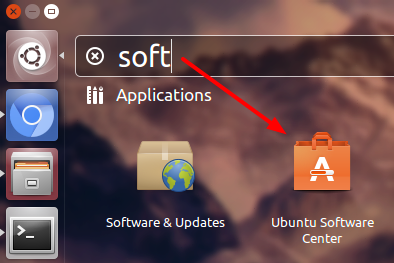

Instalarea IDE
==============

IDE este un soft în care scieți codul programelor și îl compilați (redactor de text + compilator).

.. note::

    IDE este o prescurtare în limba engleză și se descifrează ca: Integrated Development Environment.
    Se traduce ca: mediu de dezvoltare integrat.
    Dar la modul cel mai simplu este un redactor de text.

|ide|

Instalarea pe Windows
---------------------

1. Pentru a descărca IDE-ul, intrați pe `arduino.cc <https://www.arduino.cc/en/Main/Software#pagetext>`__
și alegeți din listă sistemul de operare Windows.

|download-windows|

2. Vi se va propune să donați proiectului, puteți dona sau începeți descărcarea apăsând pe butonul "JUST DOWNLOAD".

|download-or-donate|

3. Deschideți fișierul descărcat pentru a porni instalarea.

Instalarea pe Ubuntu/Linux
--------------------------

1. Deschideți Software Center. Îl puteți găsi în meniul principal scriind "soft".

|ubuntu-search-soft|

2. În Software Center căutați după cuvântul "arduino".

|ubunt-software-center-install|

Instalarea pe Mac OS
--------------------

1. Pentru a descărca IDE-ul, intrați pe `arduino.cc <https://www.arduino.cc/en/Main/Software#pagetext>`__
și alegeți din listă sistemul de operare Mac OS.

|download-mac|

2. Vi se va propune să donați proiectului, puteți dona sau începeți descărcarea apăsând pe butonul "JUST DOWNLOAD".

|download-or-donate|

3. todo...

.. include:: /images.rst.txt

.. |download-windows| image:: _static/download-windows.png
.. |download-mac| image:: _static/download-mac.png
.. |download-or-donate| image:: _static/download-or-donate.png

.. |ubunt-software-center-install| image:: _static/ubunt-software-center-install.png