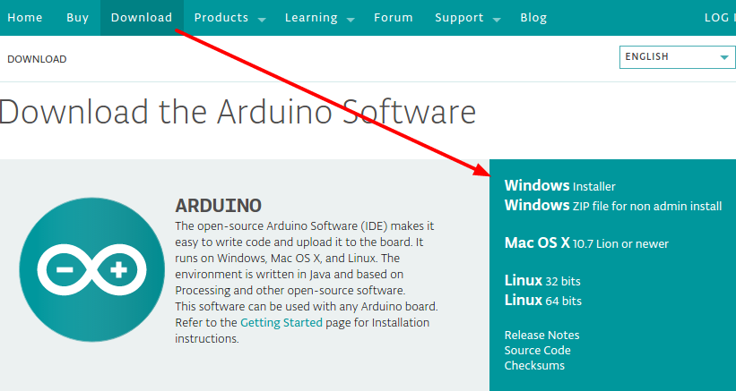
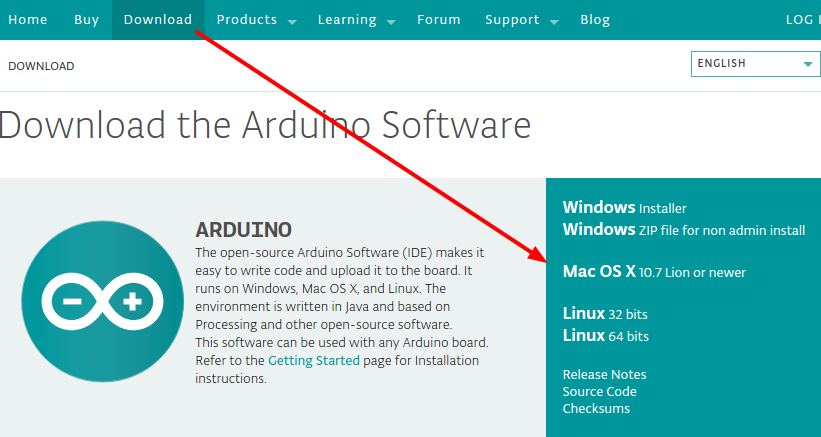
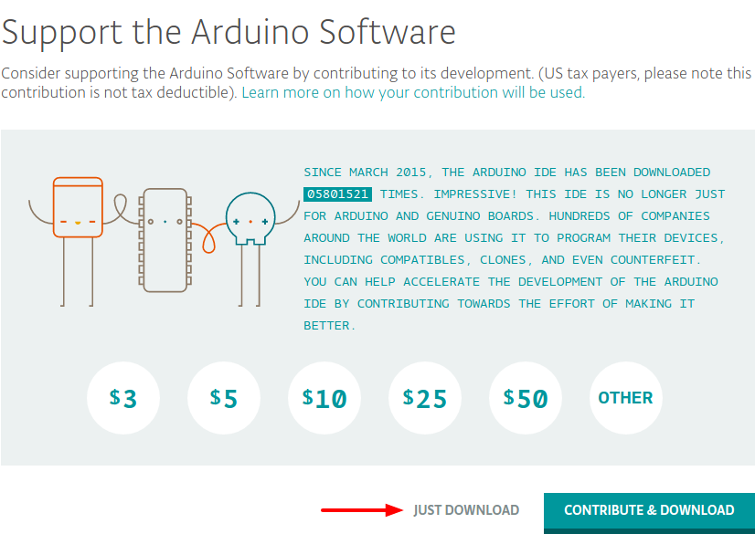
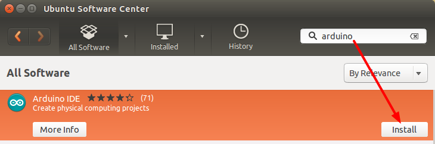

Instalarea IDE
==============

.. note::

    Alegeți un instrument prin care o să creați programele: Scratch sau IDE. Nu este nevoie să le instalați pe ambele.

IDE este un soft în care scieți codul programelor și îl compilați (redactor de text + compilator).

.. note::

    IDE este o prescurtare în limba engleză și se descifrează ca: Integrated Development Environment.
    Se traduce ca: mediu de dezvoltare integrat.
    Dar la modul cel mai simplu este un redactor de text.

|ide|

Instalarea pe Windows
---------------------

1. Pentru a descărca IDE-ul, intrați pe site-ul `arduino.cc <https://www.arduino.cc/en/Main/Software#pagetext>`__
și alegeți din listă sistemul de operare Windows.

|download-windows|

2. Vi se va propune să donați proiectului, puteți dona sau începeți descărcarea apăsând pe butonul "JUST DOWNLOAD".

|download-or-donate|

3. Deschideți fișierul descărcat pentru a porni instalarea.

Instalarea pe Ubuntu/Linux
--------------------------

1. Deschideți Software Center. Îl puteți găsi în meniul principal scriind "soft".

|ubuntu-search-soft|

2. În Software Center căutați după cuvântul "arduino".

|ubunt-software-center-install|

Instalarea pe Mac OS
--------------------

1. Pentru a descărca IDE-ul, intrați pe site-ul `arduino.cc <https://www.arduino.cc/en/Main/Software#pagetext>`__
și alegeți din listă sistemul de operare Mac OS.

|download-mac|

2. Vi se va propune să donați proiectului, puteți dona sau începeți descărcarea apăsând pe butonul "JUST DOWNLOAD".

|download-or-donate|

3. todo...

Elementele IDE-ului
-------------------

|ide-structure|

1. **Verificare**: Compilează și aprobă codul. Va găsi erorile de sintaxă (ca punct și virgulă omise sau paranteze).
2. **Încărcare**: Trimite programul la placa Arduino. Cînd faceți click pe acesta, ar trebui să vedeți cum led-urile de pe placă clipesc rapid.
3. **Program Nou**: Acest buton deschide o fereastră nouă.
4. **Deschidere Program**: Acest buton vă permite să deschideți un sketch (program) existent.
5. **Salvare**: Acest buton salvează programul curent.
6. **Serial Monitor**: Acesta va deschide o fereastră nouă care arată orice informație transmisă de placă prin canalul serial.
7. **Nume Sketch**: Acesta arătă numele programului la care lucrați la moment.
8. **Codul**: Aceasta este zonă în care scrieți codul programului.
9. **Mesaje**: Aici IDE-ul vă arată dacă sunt erori în program.
10. **Consola Text**: Aici sunt afișate mesajele de eroare complete.
11. **Placa și Serial Port**: Arată ce placă și ce port sunt setate.

.. include:: /images.rst.txt

.. |ubuntu-search-soft| image:: _static/ubuntu-search-soft.png

.. |ide-structure| image:: _static/ide-structure.png
