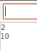
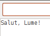
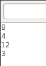

Datele
======

Toate dispozitivele conectate la Arduino trimit și primesc informație.
De exemplu, de la senzorul de lumină primiți un număr care semnifică intensitatea luminii.
Cît de tare să lumineze un led sau cît de rapid să se rotească un motor la fel se indică cu numere.
Deci este esențial să cunoașteți cum să lucrați cu datele.

În limbajele de programare cele mai simple date sunt numerele și textele.

Textele
-------

Tot ce se află între ghilimele duble este text ``"Salut!"``.

Testați următorul cod:

.. code-block:: cpp

    void setup() {
        "Salut, Lume!";
    }

    void loop() {}

Codul de mai sus a creat un text dar nu a făcut nimic cu el.
Pentru a afișa datele, în Arduino se folosește funcția ``Serial.printl(...);``.

.. note::

    În C++ după orice comandă trebuie de pus ``;``

Testați următorul cod:

.. code-block:: cpp

    void setup() {
        Serial.begin(9600);

        Serial.println("Salut, Lume!");
    }

    void loop() {}

Deschideți :ref:`Terminal serial <open-serial-terminal>` pentru a vedea textul afișat de program.

|ide-test-text|

.. note::

    Codul ``Serial.begin(9600);`` este obligatoriu pentru ca ``Serial.println(...);`` să funcționeze.

Numerele
--------

Numerele sunt folosite pentru a face calcule.

Testați următorul cod:

.. code-block:: cpp

    void setup() {
        Serial.begin(9600);

        Serial.println(2);
        Serial.println(7 + 3);
    }

    void loop() {}

În :ref:`Terminal serial <open-serial-terminal>` ar trebuie să fie afișate două numere:

|ide-test-numbers|

Cu numerele puteți face adunarea ``+``, scăderea ``-``, înmulțirea ``*``, împărțirea ``/`` și alte operații.

.. code-block:: cpp

    void setup() {
        Serial.begin(9600);

        Serial.println(6 + 2);
        Serial.println(6 - 2);
        Serial.println(6 * 2);
        Serial.println(6 / 2);
    }

    void loop() {}

|ide-test-number-operations|

